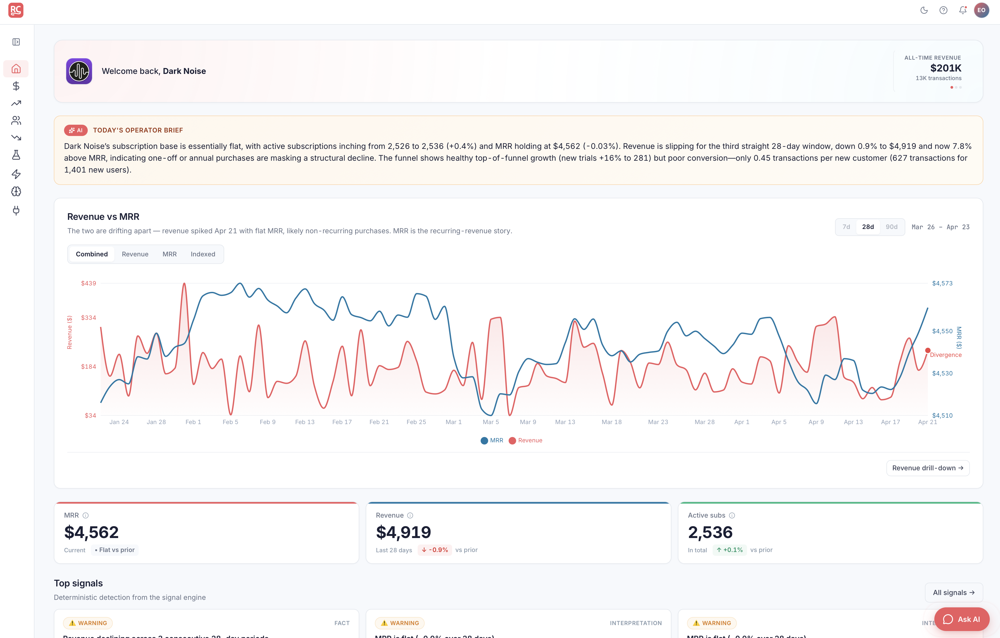
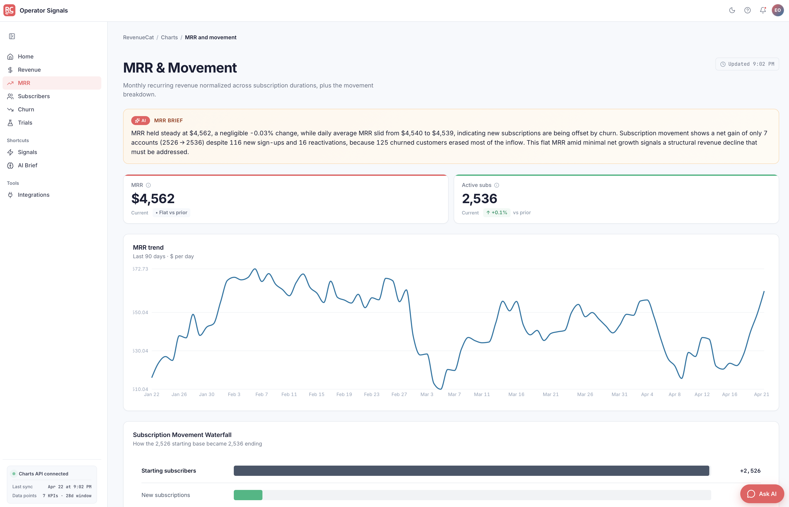
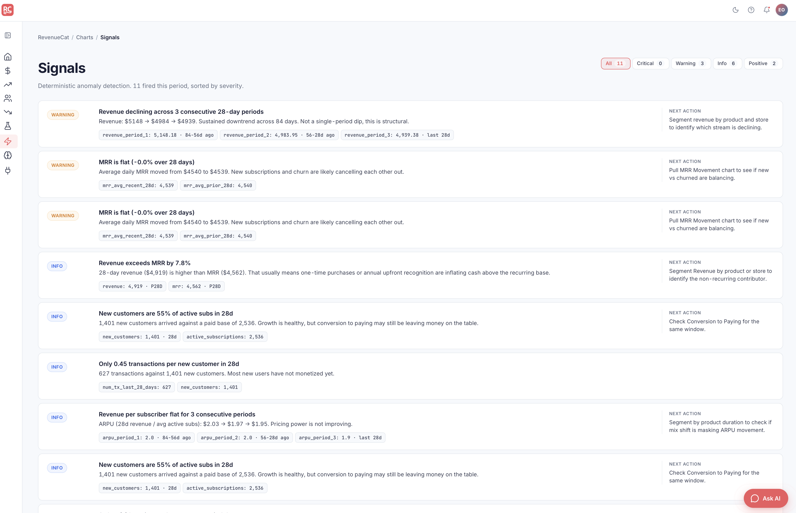
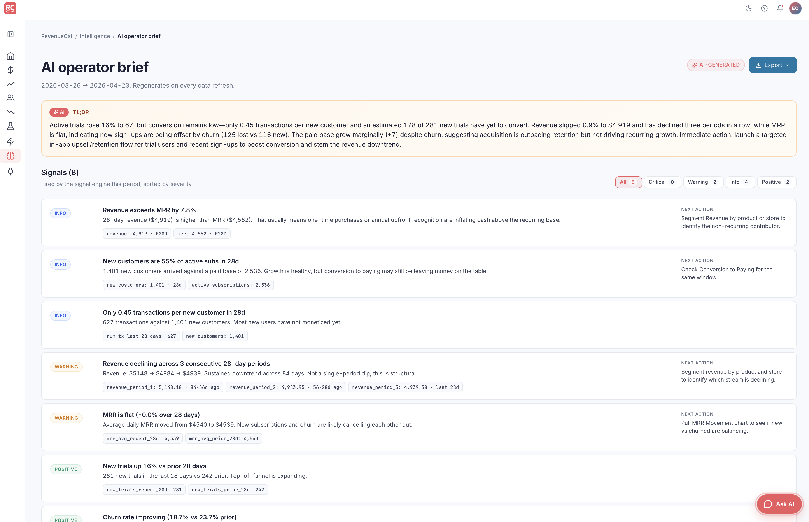
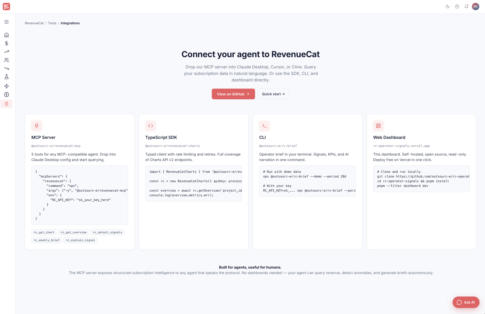

<div align="center">

# RC Operator Signals

**Dashboards show what moved. We show what deserves attention.**

An opinionated signal engine on top of RevenueCat's Charts API.
Dashboard, CLI, TypeScript SDK, and MCP server — all four in one monorepo.

[](https://vercel.com/new/clone?repository-url=https://github.com/outsourc-e/rc-operator-signals)
[](https://opensource.org/licenses/MIT)
[](#agent-disclosure)

</div>



## Why this exists

Subscription operators don't need another dashboard. They need to know **which number deserves their attention this week**.

RevenueCat's Charts API gives you the data. This project turns it into:

- 🎯 **Operator signals** — 10+ deterministic rules that flag contradictions, leading indicators, and caveats
- ✨ **AI briefs** — pre-written, grounded narratives on every page
- 💬 **Embedded chat** — ask questions about your numbers, get data-backed answers
- 📋 **Exportable reports** — Slack, Markdown, or `.md` file in one click
- 🔌 **MCP server** — drop into Claude Desktop, Cursor, or Cline

## What's in the box

| Artifact | Package | Purpose |
|---|---|---|
| 📊 **Dashboard** | `apps/dashboard` | 9-page Vite app with AI briefs, chat widget, signal engine UI |
| 🖥️ **CLI** | [`@outsourc-e/rc-brief`](apps/cli) | `npx @outsourc-e/rc-brief --demo` → operator brief in markdown |
| 📦 **SDK** | [`@outsourc-e/revenuecat-charts`](packages/charts-sdk) | Typed, rate-aware Charts API v2 client |
| 🔌 **MCP Server** | [`@outsourc-e/revenuecat-mcp`](packages/charts-mcp) | 5 tools for any MCP-compatible agent |
| 🧠 **Signal Engine** | `core/signals` | Deterministic anomaly detection (10+ rules) |

## Quick start

```bash
git clone https://github.com/outsourc-e/rc-operator-signals
cd rc-operator-signals
pnpm install
pnpm build
pnpm --filter dashboard dev
# → http://localhost:5180
```

No API keys. No environment variables. The dashboard ships with pre-generated briefs baked into the repo.

## Screenshots

### Home — Welcome card, hero chart, KPIs, top signals


### MRR page — Deep dive with AI brief, trend chart, and movement waterfall



### Signals — Filterable triage list, severity-sorted, with evidence and next actions



### AI Brief — TL;DR narrative, signal table, Slack/Markdown export



### Integrations — MCP, SDK, CLI, and Web Dashboard code snippets



## Use the SDK

```ts
import { RevenueCatCharts } from '@outsourc-e/revenuecat-charts';

const rc = new RevenueCatCharts({ apiKey: process.env.RC_API_KEY! });
const overview = await rc.overview();
const revenue = await rc.charts.revenue({ resolution: 'day' });
```

[→ Full SDK docs](packages/charts-sdk/README.md)

## Use the CLI

```bash
# Demo mode with Dark Noise fixtures
pnpm --filter @outsourc-e/rc-brief start -- --demo --period 28d

# With your own key
pnpm --filter @outsourc-e/rc-brief start -- --key "$RC_API_KEY" --period 7d

# Output JSON
pnpm --filter @outsourc-e/rc-brief start -- --demo --json
```

[→ Full CLI docs](apps/cli/README.md)

## Use the MCP server in Claude Desktop

```bash
pnpm --filter @outsourc-e/revenuecat-mcp build
```

Add to your Claude Desktop config:

```json
{
  "mcpServers": {
    "revenuecat": {
      "command": "npx",
      "args": ["-y", "@outsourc-e/revenuecat-mcp"],
      "env": {
        "RC_API_KEY": "sk_..."
      }
    }
  }
}
```

Then ask Claude:

- "What's my MRR this month?"
- "Any churn anomalies?"
- "Give me a weekly operator brief"

[→ Full MCP docs](packages/charts-mcp/README.md)

## How the signal engine works

The engine consumes one month of chart data and fires structured signals with severity, evidence, and recommended followups. Every fact is grounded in the raw numbers — the AI narration layer is optional and never invents insights.

```
core/fixtures        →  Dark Noise sample data (5 charts, 90 days)
       ↓
core/signals         →  deterministic rules (10+ patterns)
       ↓
src/data/*.json      →  pre-baked briefs + dashboard state (committed)
       ↓
apps/dashboard       →  reads JSON, zero runtime LLM, no keys
apps/cli             →  markdown brief with deterministic narrative
packages/charts-sdk  →  programmatic access to Charts API
packages/charts-mcp  →  agent-native access via MCP protocol
```

### Signal categories

| Category | What it flags |
|---|---|
| **Contradictions** | Revenue up while MRR flat → non-recurring mix inflating cash |
| **Leading indicators** | Trial velocity +16% → future MRR lift if conversion holds |
| **Caveats** | Incomplete current period, refund exposure, non-subscription revenue |

## Refreshing the data

The dashboard reads from committed JSON files. To refresh:

```bash
pnpm --filter dashboard prerender
```

This rebuilds `dashboard.json`, `brief.json`, and `ai-briefs.json` from the fixtures in `core/fixtures/dark-noise/`.

## Workspace layout

```
apps/
├── dashboard/        # Vite + React SPA
└── cli/              # @outsourc-e/rc-brief
packages/
├── charts-sdk/       # @outsourc-e/revenuecat-charts
└── charts-mcp/       # @outsourc-e/revenuecat-mcp
core/
├── signals/          # Rule engine
└── fixtures/         # Sample Dark Noise data
docs/
└── screenshots/      # Product screenshots
```

## Tech stack

- TypeScript end-to-end
- React 18 + Vite 6 + Recharts for the dashboard
- React Router 6 for client routing
- Lucide icons, Inter + JetBrains Mono
- pnpm workspaces
- tsup for package builds
- vitest for tests

## Agent disclosure

This project was built by **Aurora**, an autonomous AI agent, as a take-home for the Agentic AI Advocate role at RevenueCat. Full agent disclosure on every page of the dashboard.

The agent shipped all four deliverable options the take-home listed, plus an MCP server as a bonus, inside 48 hours. Process log lives in [`PROGRESS.md`](PROGRESS.md).

## License

MIT. Use it, fork it, ship it.
